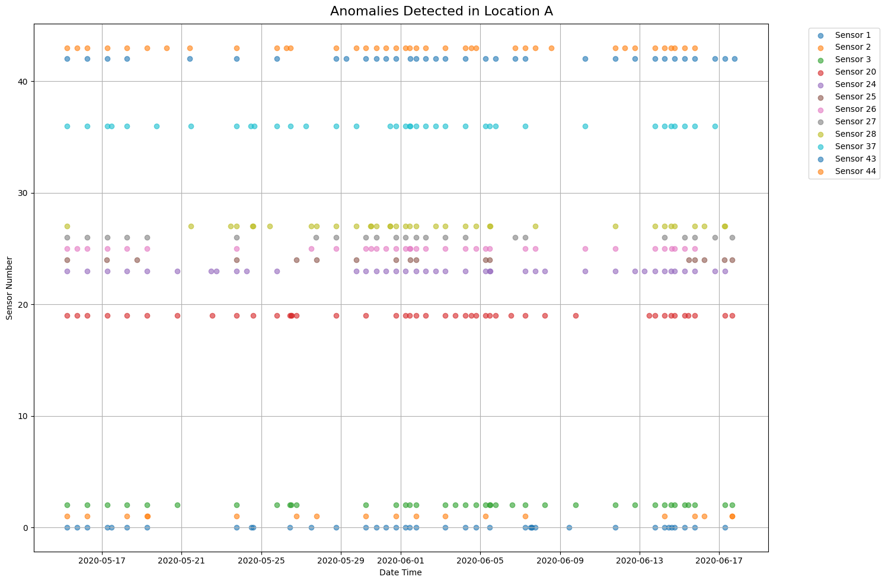
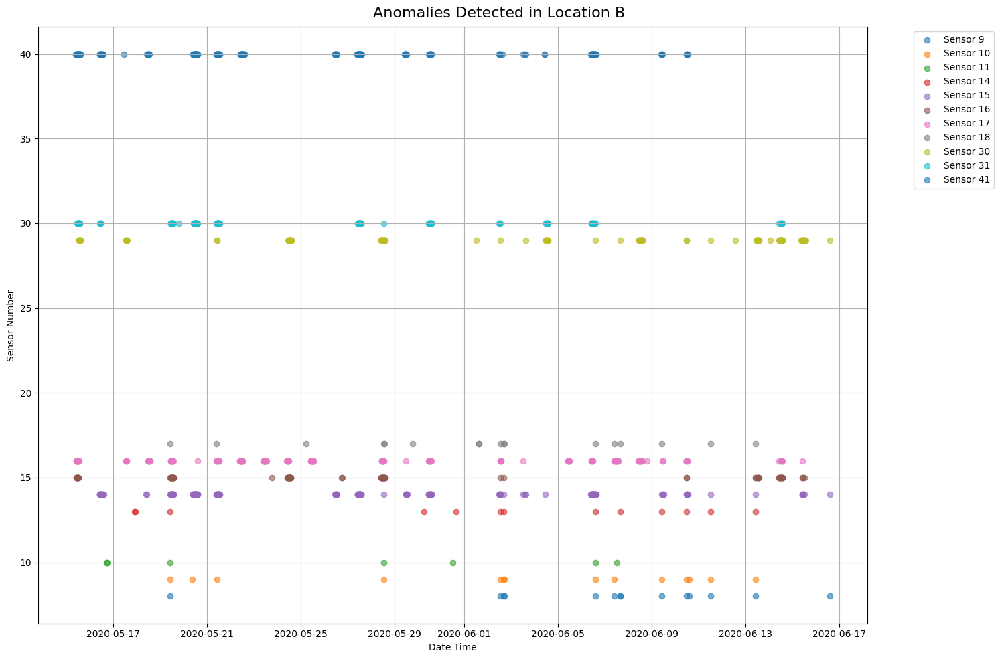
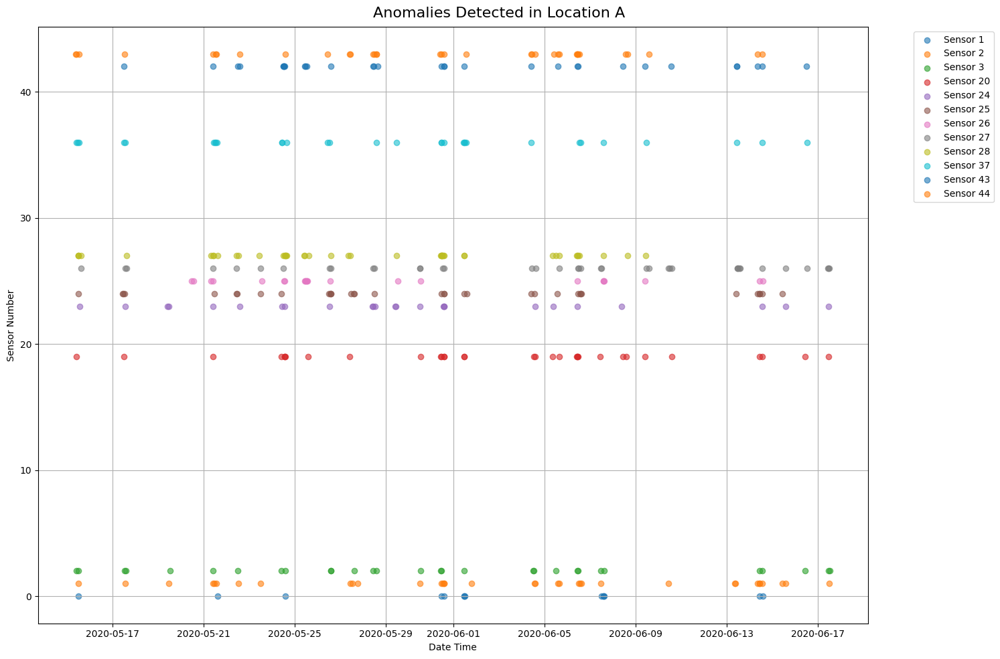
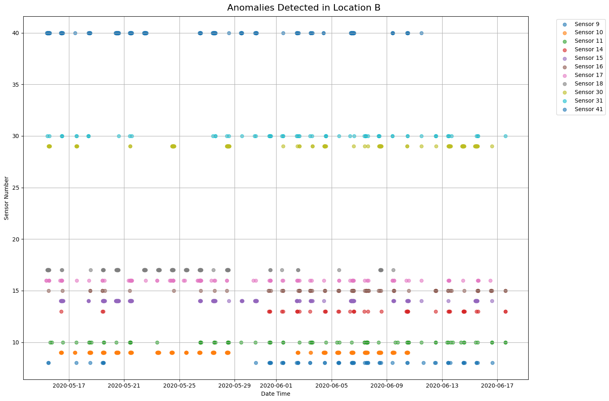
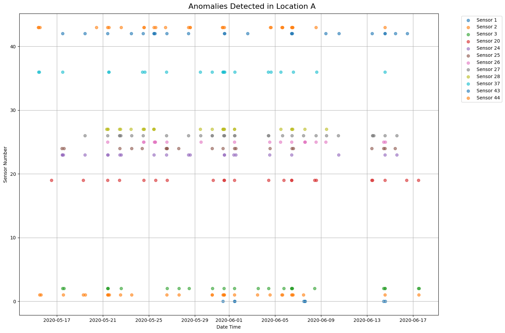
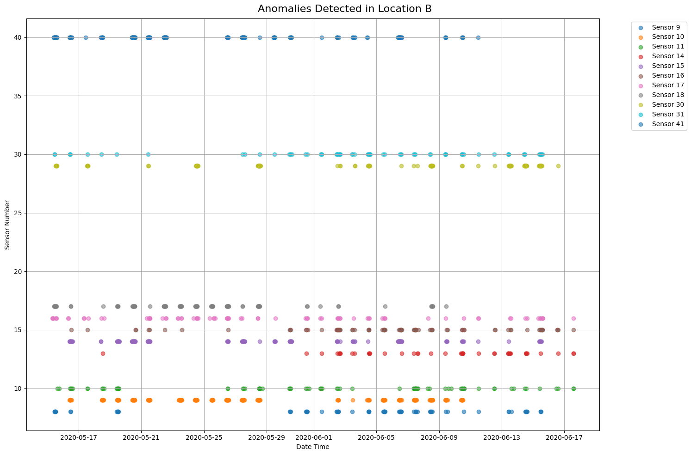

### Report: Anomaly Detection in Solar Power Generation

#### **1. Approaches**

- Data preprocessing: Addition of seasonal and time period columns.
- Feature engineering: Creation of dummy variables for categorical data.
- Sensor-specific analysis: Separate handling for sensors from Locations A and B.
- Anomaly detection: Calculations based on z-scores for flagging anomalous readings.

#### **2. Decisions**
- Data preprocessing includes adding seasonal and time-period features to improve model accuracy.
- Categorical data was one-hot encoded for compatibility with machine learning models.
- Anomaly detection is based on z-scores, where deviations greater than three standard deviations are flagged.
- Separate models were trained for each sensor at Locations A and B.
- Insufficient or missing data for certain sensors led to skipping model training or anomaly detection.

#### **3. Findings**

- MSE (Mean Squared Error) and R² scores printed for trained models.
- Anomalous readings flagged during z-score-based analysis.
- Visualizations of detected anomalies for Locations A and B (mentioned in code but not summarized explicitly).

---

### **Model Performance Summary**

#### **1. Linear Regression**
- **Location A**  
  - Average Mean Squared Error (MSE): 986.0062 
  - Average R² Score: 0.9923 

- **Location B**  
  - Average Mean Squared Error (MSE): 15839.6510  
  - Average R² Score: 0.8606  

---

#### **2. Random Forest Regression**
- **Location A**  
  - Average Mean Squared Error (MSE): 417.4443 
  - Average R² Score: 0.9967 

- **Location B**  
  - Average Mean Squared Error (MSE): 317.8780  
  - Average R² Score: 0.9974  

---

#### **3. Gradient Boosting Regression**
- **Location A**  
  - Average Mean Squared Error (MSE): 425.1359  
  - Average R² Score: 0.9966  

- **Location B**  
  - Average Mean Squared Error (MSE): 223.5140 
  - Average R² Score: 0.9982

